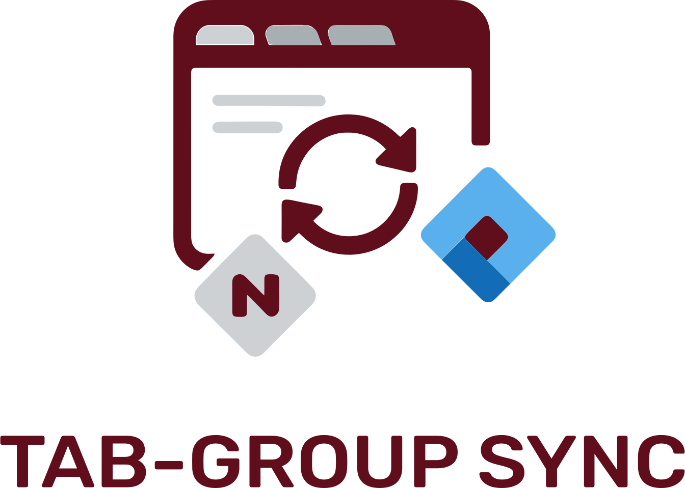
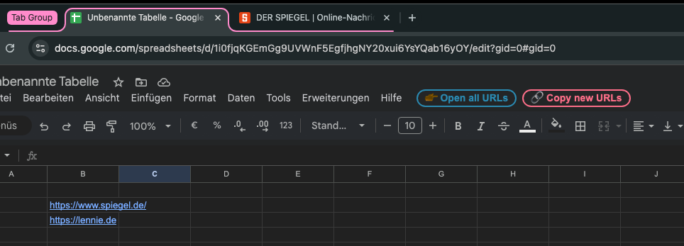

<picture>
  <source media="(prefers-color-scheme: dark)" srcset="images/logo_dark.svg" width="300">
  <source media="(prefers-color-scheme: light)" srcset="images/logo_light.svg" width="300">
  
</picture>

<h3 align="center">
	Chrome addon, that lets you sync your tab groups with Jira, Notion, or Google Sheets, so you stay organized and resume work easily.

  COPY ALL URLS IN TAB GROUP AT ONCE !!
</h3>

## 🚀 Installation 

## 🔥 Usage 

todo

## 🤝  Found a bug? Missing a specific feature?
Feel free to file a new <a href="https://github.com/lennarto/whatsapp-web-copy-link/issues" target="_blank">Issue</a>.

## 💙 Support 
##### 🤝 Contact me
I love building digital products, working in it-strategy, or applying ai in real-world use cases. On top of that, i create private it expert reports (🇩🇪 IT-Gutachten) for legal proceedings in germany, especially in criminal cases.
👉 [My website](https://lennie.de) 👈

##### 🍻 Buy me a beer 

If you’ve found something useful, feel free to fuel my next project with a Beer! 🍻 I do have a couple of cool ideas in my backlog 🚀

## 📙 License
"reopen-existing-tab" is released under the terms of the [MIT License](LICENSE).